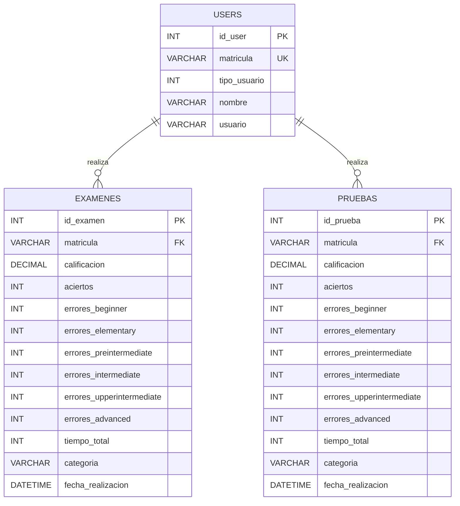
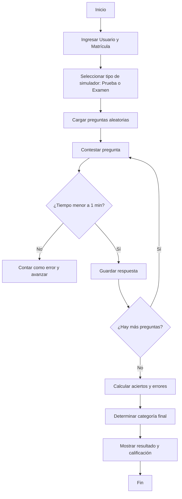
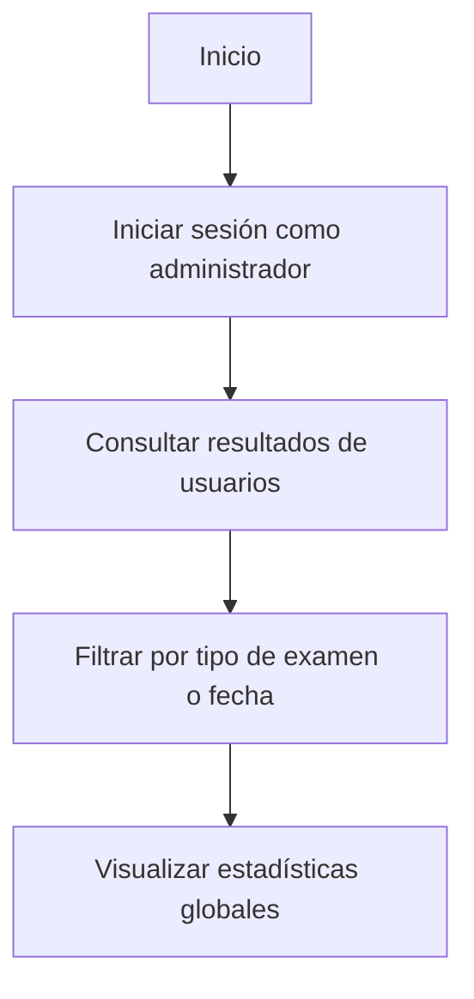

# 🧩 Proyecto Parcial 2 y Ordinario – “Simulador de Examen de Inglés”

## 🎯 1. Estrategia General del Proyecto

**Nombre del sistema:**  
**Test of English Basic & Intermediate**

**Descripción:**  
El proyecto consiste en el desarrollo de una aplicación informática que permite evaluar el nivel de inglés de los alumnos mediante un simulador de examen.  
El sistema contará con **dos tipos de exámenes**:

- **Simulador de práctica:** 20 preguntas aleatorias (hasta 5 intentos por usuario).  
- **Examen final:** 40 preguntas aleatorias (hasta 2 intentos por usuario).  

El sistema determinará el **nivel del alumno (Básico, Intermedio o Avanzado)** en función de su desempeño, mostrando resultados porcentuales, errores por categoría y tiempo total.

**Objetivo principal:**  
Evaluar y reforzar el aprendizaje del idioma inglés a través de una plataforma de práctica con retroalimentación y estadísticas de rendimiento.

**Tecnologías utilizadas:**
- **Lenguaje:** Python  
- **Base de datos:** MySQL (implementada mediante XAMPP)  
- **Interfaz y dashboard:** Por definir (se añadirá más adelante)

---

## 👥 2. Control de Usuarios

Cada usuario podrá acceder al sistema mediante:
- **Usuario**
- **Matrícula**

Ambos datos se almacenan en la base de datos.  
Cada intento (ya sea práctica o examen) se vincula con la matrícula para mantener un historial individual de resultados.

**Tipos de usuario:**
- `1` → Alumno  
- `2` → Administrador  

---

## 🧠 3. Modelo de Base de Datos (Relacional)

### 💾 Diagrama ER (Mermaid)

**Descripción del modelo:**  
- Cada usuario puede realizar **múltiples exámenes** y **múltiples pruebas de práctica**.  
- Las tablas `EXAMENES` y `PRUEBAS` almacenan calificación, tiempo y errores clasificados por nivel.  
- La columna `categoria` indica el nivel obtenido (Beginner, Elementary, etc.).  
- El campo `tipo_usuario` permite diferenciar administradores de alumnos.

---

## 🔄 4. Diagramas de Flujo

### 🧩 a) Flujo del Usuario

### 🧩 b) Flujo del Administrador

## 📘 Notas finales

- Cada pregunta tiene un tiempo límite de **1 minuto**; si no se responde, se marca como errónea.  
- Las preguntas se cargan **de forma aleatoria** para evitar repeticiones dentro del mismo intento.  
- Los resultados se almacenan automáticamente en la base de datos para generar reportes y dashboards más adelante.  
- Los intentos de práctica están limitados a **5 por usuario**, mientras que los exámenes finales solo se pueden realizar **2 veces**.  
- El sistema determinará el nivel del estudiante según su puntaje final (**Básico**, **Intermedio** o **Avanzado**).  
- La base de datos servirá para registrar intentos, calcular promedios y mostrar estadísticas comparativas entre pruebas y exámenes finales.
